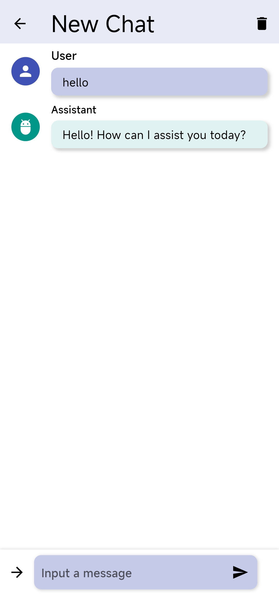
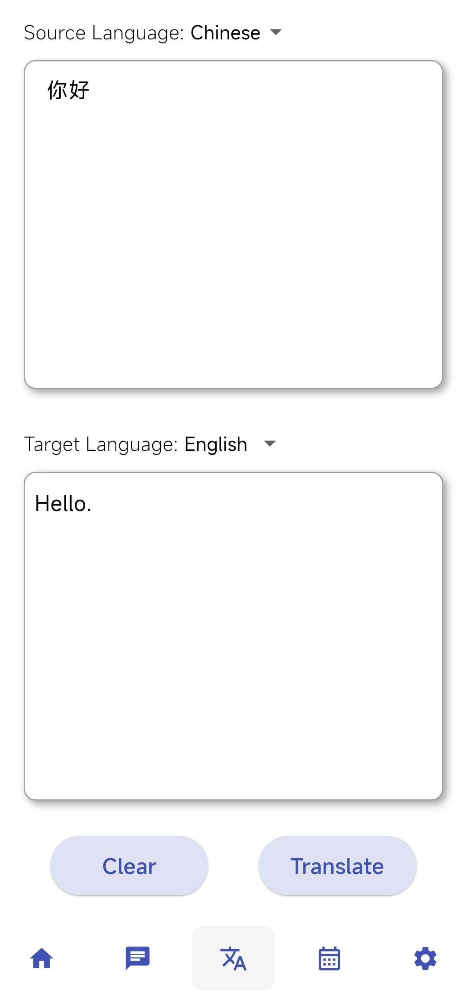
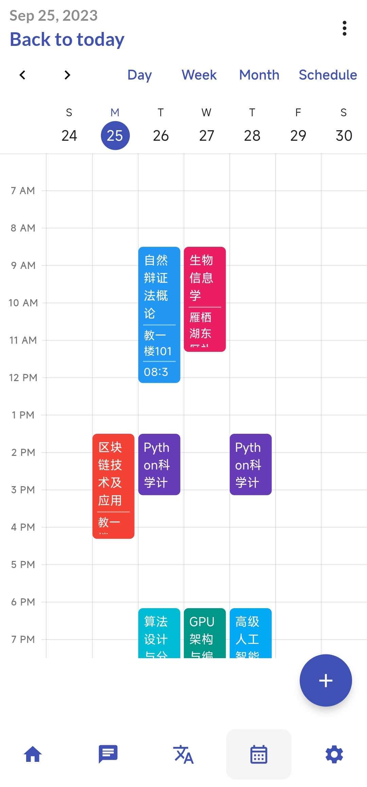

# ucas_tools

A new Flutter project.

## Getting Started

You can:
- Visit chatgpt using api-keys in Chat page.

- Use chatgpt for translation in Translate page.

- Automatically parse the syllabus information from UCAS website.

For help getting started with Flutter development, view the
[online documentation](https://docs.flutter.dev/), which offers tutorials,
samples, guidance on mobile development, and a full API reference.
